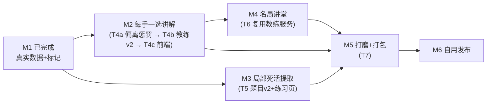

# 「弈友」v2 后续阶段计划书（M2 ~ M6）

> 2026-08-31 · 基于《项目书v2》§6/§7 与当前实际进度制定。
> 执行纪律不变：任务书三要素（做什么/禁止做什么/验收方式）、mock 优先（¥0）、真实 API 仅限 prompt 迭代（max_tokens≤400）与阶段验收抽测、结果本地缓存、Playwright 截图验收、API 只增不改。

## 0. 当前进度盘点（已完成 ✅）

| 项 | 状态 | 证据 |
|---|---|---|
| M0 棋盘命门（WGo.js 复盘页） | ✅ | `docs/tasks/evidence/m0-1~4.png`，9/13/19 路自检 PASS |
| M1 后端迁移 + 复盘真实数据实装 | ✅ | `m1-1~7.png`，真实胜率曲线/关键手/一选标记/讲解面板，验收脚本 EXIT=0 |
| T0 可维护性基座（修 bug/打补丁/更新操作端） | ✅ | `schema_migrations` 迁移机制 + `/health`、`/engine/status|restart`、`/logs`、`/cache/clear`、`/db/backup`、`/version` |
| T1 GPU/CPU 自动适配 | ✅ | `katago.backend: auto|cpu|opencl`，本机探测 opencl，无 GPU 回退 eigenavx2 |
| 后端测试基线 | ✅ | 101+ 项全绿（含引擎端到端） |

---

## 1. M2 每手一选讲解（第 4~5 周 · 预算 ¥80，prompt 迭代大头）

**目标**：任意手点击即出"一选理由 + 变化必然性"讲解；普通手批量简评控制成本。

### T4a 任务书：偏离惩罚查询（窗口1，引擎）
- **做**：在 `backend/services/engine/` 新增"偏离惩罚查询"——对一手的 PV 每步计算"若对手偏离应手，将损失多少胜率/目数"（实现：对 PV 每步用 KataGo 额外 query 该偏离点，对比原 PV 胜率）。产出结构 `deviation_penalties: [{pv_step, deviation_move, winrate_loss, points_loss}]`；仅对关键手启用（控制引擎负载）。
- **禁**：改动现有复盘分析契约；每次偏离都跑 full 搜索（用低 visits 快速档）。
- **验收**：9 路示例任一坏手返回 ≥3 步偏离惩罚数据，单次查询 <30s；后端测试全绿。

### T4b 任务书：教练服务 v2（窗口2，LLM）
- **做**：
  1. 讲解 JSON 结构扩展（契约 §6 只增不改）：`situation`（形势判断）、`intentions`（双方意图）、`tesuji`（手筋名称）、`variations`（多条变化，含偏离惩罚）、`pitfalls`（易错点）；
  2. `POST /api/v1/review/{id}/explain_move`：任意手详讲（一选理由 + 必然性），输入含 KataGo 数据 + 偏离惩罚；
  3. `POST /api/v1/review/{id}/explain_batch`：普通手批量简评（30 手/次打包，一次 LLM 调用）；
  4. 缓存 key = prompt 版本 + review_id + move；升级 prompt 后 `/cache/clear` 强制刷新；
  5. 成本记账进 `coach_calls`（已有表）。
- **禁**：`deepseek-reasoner`（价格翻倍）；max_tokens > 400 的 prompt 迭代调用；失败重试风暴（最多 1 次重试）。
- **验收**：真实对局抽测 3 局截图（关键手详讲 + 批量简评可读）；单局成本实测 ≤ ¥1.2；prompt 版本号入缓存 key。

### T4c 任务书：前端讲解实装（窗口4）
- **做**：任意手点击出讲解（现仅关键手）；关键手详讲面板展示新字段（形势/意图/手筋/变化/易错点）；普通手简评列表批量渲染；讲解生成中 loading + 失败降级提示；「变化必然性」在棋盘上播放偏离变化（WGo.KifuReader 或 Board 标记，禁手写）。
- **禁**：自写变化播放逻辑；重复请求已缓存讲解。
- **验收**：3 局真实对局截图（详讲/简评/必然性各 ≥1 张）。

**M2 预算纪律**：迭代期每次调用 3~5 个样例、max_tokens≤400；先 mock 调 UI，UI 通后才真实调 prompt；每日查 `coach_calls` 用量。

---

## 2. M3 局部死活提取（第 6~7 周 · 预算 ¥25）

**目标**：从任意输入棋局自动扫描未定型区域 → 识别死活/对杀局部 → 自动成题入库，练习页接入。

### T5 任务书：题目系统 v2（窗口3 + 前端练习页）
- **做**：
  1. 全盘扫描：复盘数据中标记"高变化量"区域（某手 winrate 波动大/多候选点接近）；
  2. 局部裁剪（`crop_radius` 配置已有）→ 候选局部；
  3. 多分支验题（复用 `verify.py` + `checker.py`）：唯一正解判定、失败即丢弃；
  4. `POST /api/v1/problems/extract`：输入 SGF → 返回题目列表（新契约，只增不改）；
  5. 前端练习页 `practice.html`：WGo.js 出题/落子判断（复用 checker 判定）、对错反馈。
- **禁**：改 v1 契约 §4.3 字段；降低验题阈值凑数（提取率低不丢人）。
- **验收**：任意 1 局 19 路提取 ≥5 道验证唯一正解的题（截图）；`problems` 表入库可查；练习页做对/做错反馈正确。

---

## 3. M4 名局讲堂（第 8~9 周 · 预算 ¥35）

**目标**：内置公版古谱 ≥10 局 + 原创赏析 + 讲堂页。

### T6 任务书：名局讲堂（窗口5 + 前端）
- **做**：
  1. 整理公版古谱 10~20 局（本因坊秀策等已进入公共领域的棋谱，从公版来源取得并注明出处）；
  2. `GET /api/v1/masterpieces` 列表、`GET /api/v1/masterpieces/{id}/analysis`（复用复盘管线）、`POST /api/v1/masterpieces/{id}/appreciation`（赏析：背景故事 + 关键手解读 + 一选对照，LLM 原创生成，缓存）；
  3. 前端讲堂页 `masterpieces.html`：列表 + 赏析 + 复盘联动（WGo.js）。
- **禁**：内置任何受版权保护的现代棋谱；赏析摘抄他人解说（必须 LLM 原创）；赏析默认预生成烧预算（改为按需生成 + 缓存）。
- **验收**：古谱列表 ≥10 局；任选 1 局赏析截图（背景/关键手/一选对照齐全）；版权来源说明文档。

---

## 4. M5 丰富与打磨（第 10~11 周 · 预算 ¥20）

**目标**：讲解字段落 UI 收尾、体验优化、桌面打包 exe。

### T7 任务书：打磨 + 桌面打包（窗口4/6）
- **做**：
  1. 三页（复盘/练习/讲堂）体验统一：空态/错误态/加载态、快捷键（←→ 前进后退、空格播放）；
  2. 设置页完成"更新功能操作端"：引擎后端切换、档位切换、清缓存、日志查看、数据库备份、版本显示（后端 T0 已备齐，只差 UI 收尾）；
  3. 桌面打包：pywebview 壳 + PyInstaller（`scripts/build_desktop.py` 已有，v2 适配新前端与引擎路径），注入语义化版本号；
  4. 首次启动引导（引擎探测结果提示 + 后端自检）。
- **禁**：引入新依赖；打包中遗漏 `frontend/`、`engine/`、模型文件。
- **验收**：exe 双击可用（截图）；无后端时三页正常降级；`/system/version` 与 exe 版本一致。

---

## 5. M6 自用发布（第 12 周 · 应急缓冲 ¥30）

**目标**：连续自用 2 周无阻塞 bug。

- **做**：按 §9 验收清单逐项核对；每日自用 1~2 局完整流程（复盘→讲解→出题）；记录 bug 走 T0 运维接口（日志/备份/清缓存）修复。
- **验收清单**（项目书 §9）：
  - [ ] 9/13/19 路棋盘正常、无自研棋盘代码
  - [ ] 任意手点击出讲解；关键手详讲含一选理由+必然性；简评可读
  - [ ] 讲解字段含形势/意图/手筋/易错点，变化与 KataGo 数据一致
  - [ ] 任意 19 路棋局提取 ≥5 道唯一正解题
  - [ ] 古谱 ≥10 局，赏析含背景/关键手/一选对照
  - [ ] exe 双击可用；连续自用 2 周无阻塞 bug
  - [ ] API 花费 ≤¥200，按里程碑分配有日志佐证

---

## 6. 依赖与执行顺序

- M2 内部顺序：T4a（引擎偏离惩罚）→ T4b（教练 prompt 迭代，预算大头）→ T4c（前端），每步验收后进下一步；
- M3 与 M2 后端无冲突，可并行派发（两个 agent）；
- M4 依赖 M2 的教练服务（赏析复用讲解管线），放在 M2 验收后。

## 7. 预算使用节奏（对照项目书 §6）

| 阶段 | 预算 | 主要用途 |
|---|---|---|
| M2 | ¥80 | 讲解 prompt 迭代（max_tokens≤400，一次 3~5 样例）+ 3 局验收抽测 |
| M3 | ¥25 | 验题与讲解抽测 |
| M4 | ¥35 | 赏析 prompt 迭代 |
| M5~M6 | ¥20+30 缓冲 | 发布前抽测 / 调价意外 |

每阶段开工前核对 DeepSeek 余额；超支动用缓冲需人工复核；相同输入一律缓存。

## 8. 主要风险

| 风险 | 对策 |
|---|---|
| 偏离惩罚查询拖慢分析 | 仅关键手启用 + 低 visits；单次 <30s 验收硬指标 |
| prompt 迭代烧预算 | 一次调用测 3~5 样例；缓存 + 每日用量日志；禁用 reasoner |
| 局部死活提取误判 | 多分支验题失败即丢弃；提取率低不影响核心复盘 |
| 古谱版权 | 仅公版 + 出处说明；赏析 LLM 原创 |
| 打包漏资源 | 验收清单含 frontend/engine/模型；exe 双击实测 |
